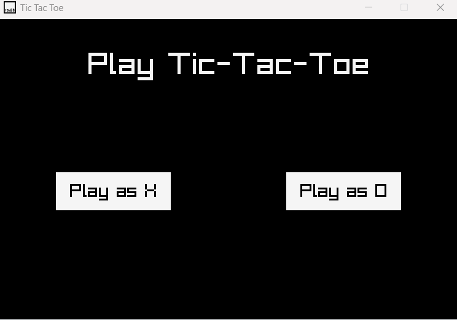

# 🎮 Tic Tac Toe (C++ / Raylib)

A simple raylib learning project creating Tic-Tac-Toe with C++.



---

## ✨ Features
- 🕹️ Player vs AI
- 🧩 Modular UI built with raylib

---

## ⚙️ Build & Run

### 🪟 Windows (Visual Studio)
Run the provided build script:
```bash
build-VisualStudio2022.bat 
```
This generates the Visual Studio solution and project files automatically.
Then open the .sln file, build, and run.

---

## Resources / Links

* **Raylib:** https://github.com/raylib-extras/raylib-quickstart
* **Raylib Cheatsheet:** https://www.raylib.com/cheatsheet/cheatsheet.html

---

## License

MIT
